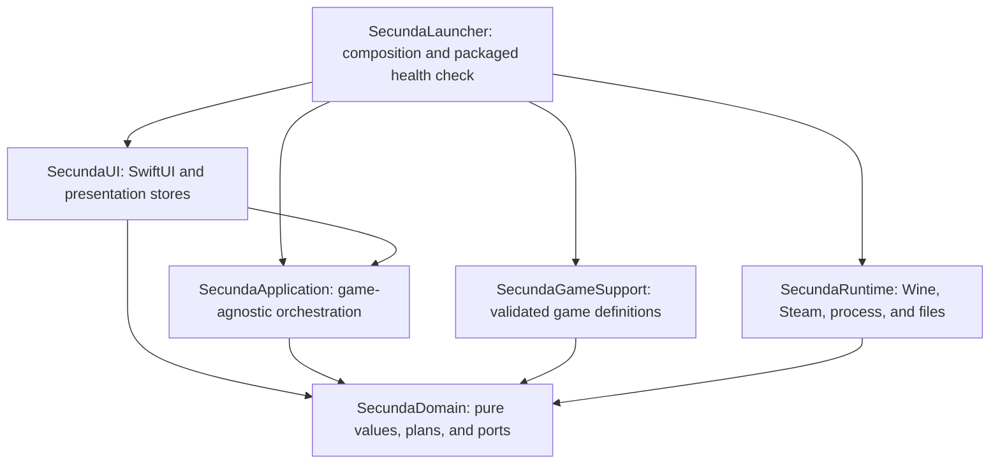

# Target architecture

## North star

Build a modular monolith:

- one macOS application;
- one statically linked executable product;
- one shared Wine runtime;
- one physical bottle and Steam installation;
- six balanced Swift modules;
- one bottle-owned mutation coordinator;
- immutable declarative definitions for games;
- pure planning separated from effectful execution;
- generic UI driven by typed capabilities.

Game isolation does not require per-game bottles, per-game actors, per-game services, dynamic plugins, or a target per game.

## Dependency graph



`SecundaApplication` depends on domain-owned ports, not the concrete live runtime. `SecundaLauncher` is the composition root that injects live adapters.

## Intended SwiftPM shape

The eventual package structure is conceptually:

```swift
let package = Package(
    name: "SecundaLauncher",
    platforms: [.macOS(.v15)],
    products: [
        .executable(name: "SecundaLauncher", targets: ["SecundaLauncher"])
    ],
    targets: [
        .target(name: "SecundaDomain"),
        .target(
            name: "SecundaGameSupport",
            dependencies: ["SecundaDomain"]
        ),
        .target(
            name: "SecundaRuntime",
            dependencies: ["SecundaDomain"]
        ),
        .target(
            name: "SecundaApplication",
            dependencies: ["SecundaDomain"]
        ),
        .target(
            name: "SecundaUI",
            dependencies: ["SecundaDomain", "SecundaApplication"]
        ),
        .executableTarget(
            name: "SecundaLauncher",
            dependencies: [
                "SecundaDomain",
                "SecundaGameSupport",
                "SecundaRuntime",
                "SecundaApplication",
                "SecundaUI"
            ]
        ),
        .testTarget(
            name: "SecundaDomainTests",
            dependencies: ["SecundaDomain"]
        ),
        .testTarget(
            name: "SecundaGameSupportTests",
            dependencies: ["SecundaDomain", "SecundaGameSupport"]
        ),
        .testTarget(
            name: "SecundaRuntimeTests",
            dependencies: ["SecundaDomain", "SecundaRuntime"]
        ),
        .testTarget(
            name: "SecundaApplicationTests",
            dependencies: [
                "SecundaDomain",
                "SecundaApplication",
                "SecundaGameSupport"
            ]
        )
    ],
    swiftLanguageModes: [.v5]
)
```

Exact paths should be added one target at a time during Phase 8. Prefer Swift `package` visibility for cross-target implementation APIs instead of making the whole architecture public.

## Target responsibilities

### `SecundaDomain`

Foundation-only pure code:

- validated identifiers;
- catalog and definition values;
- settings and state manifests;
- display and compatibility plans;
- launch health contracts;
- immutable application snapshots;
- effect-boundary protocols.

Forbidden dependencies:

- SwiftUI;
- AppKit;
- Darwin process APIs;
- filesystem, network, registry, or process execution.

### `SecundaGameSupport`

- One definition file per game or intentionally shared family.
- Small reusable family/profile builders.
- Catalog construction and validation.
- No I/O and no bottle path knowledge.
- No public access to individual static definitions; expose only a validated catalog entry point.

Suggested public API:

```swift
public enum SecundaGameCatalog {
    public static func make() throws -> GameCatalog
}
```

### `SecundaRuntime`

All live effect adapters:

- managed paths and containment;
- process supervision and output capture;
- Wine runtime location and integrity;
- bottle initialization and shutdown;
- compatibility reconciliation;
- monotonic capability installation;
- Steam client and library indexing;
- exact-bottle monitoring;
- broad recovery scanning;
- profile-plan execution;
- game-state file operations;
- diagnostics and launch-outcome recording.

Most implementations remain `internal` or `package`. Expose narrow live factories or domain-port conformances, not every helper type.

### `SecundaApplication`

- `BottleSessionCoordinator`;
- `GameLaunchPlanner`;
- `LauncherController`;
- library-refresh coordination;
- operation scope and activity routing;
- application state reduction.

No concrete game-ID switch is allowed in this target.

### `SecundaUI`

- root shell and typed routing;
- stable presentation stores;
- library, game-detail, settings, and support features;
- artwork and display adapters;
- clipboard and Finder reveal boundaries.

Views receive immutable display-ready values and send typed intents. They do not query files, processes, Steam, logs, or display globals from `body`.

### `SecundaLauncher`

- build catalog;
- build live runtime adapters;
- build controller and stores;
- present the root view;
- retain a small packaged health check.

No product logic lives here.

## Proposed source tree

```text
Sources/
  SecundaDomain/
    IDs/
    Catalog/
    Configuration/
    Runtime/
    State/

  SecundaGameSupport/
    SecundaGameCatalog.swift
    Shared/
    Games/

  SecundaRuntime/
    Paths/
    Process/
    Wine/
    Bottle/
    Steam/
    Monitoring/
    Profiles/
    State/
    Diagnostics/

  SecundaApplication/
    Launch/
    Library/
    State/

  SecundaUI/
    Store/
    Features/
      Shell/
      Library/
      GameDetail/
      Settings/
    Shared/

  SecundaLauncher/
    SecundaLauncherApp.swift
    LauncherAssembly.swift
    PackagedHealthCheck.swift
```

## Validated identifiers

Wrap values that cross process, persistence, lookup, or containment boundaries:

```swift
public struct GameID: RawRepresentable, Codable, Hashable, Sendable
public struct GameGroupID: RawRepresentable, Codable, Hashable, Sendable
public struct StateDomainID: RawRepresentable, Codable, Hashable, Sendable
public struct ProcessIdentityDomainID: RawRepresentable, Codable, Hashable, Sendable
public struct SteamAppID: RawRepresentable, Codable, Hashable, Sendable
public struct RelativePath: RawRepresentable, Codable, Hashable, Sendable
public struct ProcessImageName: RawRepresentable, Codable, Hashable, Sendable
public struct ChoiceID: RawRepresentable, Codable, Hashable, Sendable
```

Validation:

- `RelativePath`: no absolute path, drive prefix, NUL, empty component, `.`/`..`, or unsafe separator.
- `ProcessImageName`: one basename, no path separator.
- `SteamAppID`: nonempty ASCII digits.
- IDs: stable lowercase slugs with explicit migration for renamed legacy values.

Do not introduce wrappers for every title, label, caption, registry string, or number.

## Composed game definition

```swift
public struct GameDefinition: Equatable, Sendable {
    public let identity: GameIdentity
    public let presentation: GamePresentation
    public let installation: SteamInstallSpec
    public let processes: GameProcessSpec
    public let launch: GameLaunchSpec
    public let compatibility: GameCompatibilitySpec
    public let configuration: GameConfigurationSpec
    public let state: GameStateSpec
    public let diagnostics: GameDiagnosticsSpec
}
```

Each member is cohesive. Adding a new field to one concern does not widen every caller.

### Identity and grouping are distinct

```swift
public struct GameIdentity: Equatable, Sendable {
    public let id: GameID
}

public struct GameGroupComponent: Equatable, Sendable {
    public let gameID: GameID
    public let modeTitle: String
}

public struct GameGroupDefinition: Equatable, Sendable {
    public let id: GameGroupID
    public let title: String
    public let components: [GameGroupComponent]
    public let artworkGameID: GameID
    public let defaultGameID: GameID
}
```

UI grouping, launch identity, saved-state ownership, and shared process identity must not be inferred from each other.

### Installation and process contracts

```swift
public struct SteamInstallSpec: Equatable, Sendable {
    public let appID: SteamAppID
    public let executable: RelativePath
    public let baselineFiles: [FileRequirement]
    public let estimatedInstallBytes: Int64?
    public let addOns: [AddOnDefinition]
}

public struct GameProcessSpec: Equatable, Sendable {
    public let gameImages: [ProcessImageName]
    public let launcherImages: [ProcessImageName]
    public let sharedIdentityDomain: ProcessIdentityDomainID?
    public let health: LaunchHealthSpec
}
```

Process-name overlap is invalid unless both definitions deliberately declare the same identity domain.

## Configuration model

Keep a small closed set of file recipes rather than a universal effect graph:

```swift
public enum ProfileRecipe: Equatable, Sendable {
    case writableSectionedINI(WritableINIRecipe)
    case existingSectionedINI(ExistingINIRecipe)
    case existingQuotedKeyValues(QuotedKeyValuesRecipe)
    case existingLuaPreferences(LuaPreferencesRecipe)
}
```

Semantics:

- User-owned writable INI may create declared sections and keys.
- Install-owned or generated INI updates existing keys only.
- Quoted KeyValues has a dedicated parser.
- Lua mutation is bounded to declared table/key paths.
- Editors are pure `String -> String` transformations.
- One runtime executor owns path containment, symlink rejection, atomic write, equality skip, receipts, and rollback.

Persist stable choice identity:

```swift
public struct SettingChoice: Equatable, Sendable {
    public let id: ChoiceID
    public let label: String
}
```

Persist `[optionID: choiceID]`, never visible labels.

Keep quality, tuning, launch, display, and compatibility choices distinct. Do not collapse them into an opaque dictionary of effects.

## Compiled profiles versus resources

Initial decision: compiled Swift definitions.

Reasons:

- exhaustive typed capabilities;
- compiler-checked recipes;
- no dynamic executable behavior;
- simple packaging while the current app bundle script copies only the binary, plist, icon, and runtime;
- clear code review and source provenance.

Possible later evolution:

- move purely descriptive leaf data into versioned schema-validated resources;
- keep compatibility semantics and allowed effects in closed Swift enums;
- include every resource bundle in package manifests, signing, provenance, and verification;
- reject unknown schema/capability versions at boot.

Do not create a dynamic plugin loader, reflection-driven UI, arbitrary script hooks, or unvalidated JSON environment maps.

## Catalog invariants

`GameCatalog(validating:groups:)` should enforce:

1. Unique game and group IDs.
2. Every group is nonempty.
3. Every game belongs to exactly one group.
4. Default and artwork members belong to their group.
5. Steam IDs are valid.
6. All managed paths are safe.
7. Every game declares exact process images.
8. Process images are unique case-insensitively inside a definition.
9. Cross-definition image overlap has an explicit shared identity domain.
10. Install executable identity is represented in launch/handoff policy.
11. Option IDs are unique.
12. Choice IDs are unique within an option.
13. Defaults reference valid choice IDs.
14. Preferred display mode is supported.
15. Profile targets and fields are nonempty and unique.
16. Existing-only recipes cannot target templates/defaults.
17. Add-on IDs and paths are valid.
18. Timeouts, byte estimates, and frame caps are positive.
19. Required renderer/audio behavior declares the matching bottle capability.
20. Shared state domains use compatible backup/reset policies.

Catalog failure produces a structured boot failure. Never `try!` and never silently substitute a known game.

## Pure launch plan

```swift
public struct GameLaunchPlanner {
    public func makePlan(
        game: GameDefinition,
        settings: GameSettings,
        installation: ResolvedInstallation,
        display: HostDisplayGeometry,
        bottlePolicy: BottlePolicy
    ) throws -> GameLaunchPlan
}
```

Short pure helpers:

- `resolveSessionSettings`
- `resolveDisplay`
- `resolveCompatibility`
- `resolveArguments`
- `resolveProfileWrites`
- `resolveHealthPlan`
- `resolveObservability`

`GameLaunchPlan` contains:

- required bottle/session fingerprint;
- complete compatibility mutations;
- monotonic capability requirements;
- profile write plan;
- Steam/direct invocation;
- health contract;
- bounded observability policy.

It contains no arbitrary closures and performs no effects.

## Runtime ports

Use protocols only at genuine effect boundaries. Prefer one coherent game-space facade to one protocol per helper:

```swift
public protocol GameSpaceRuntime: Sendable {
    func snapshot(freshness: SnapshotFreshness) async throws -> GameSpaceSnapshot
    func ensureCapabilities(_ values: Set<BottleCapability>) async throws
    func reconcile(_ plan: BottleCompatibilityPlan) async throws
    func apply(_ plan: ProfileWritePlan) async throws
    func requestSteam(_ request: SteamRequest) async throws
    func launch(_ request: GameProcessLaunchRequest) async throws
    func waitForHealth(_ plan: LaunchHealthPlan) async throws -> LaunchHealthResult
    func restoreNeutralProfileIfQuiet() async throws
}
```

Broad recovery remains separate:

```swift
public protocol SecundaRecoveryRuntime: Sendable {
    func scanAllSecundaProcesses() async throws -> [ManagedProcess]
    func forceStop(_ identities: [ManagedProcessIdentity]) async
}
```

Other useful boundaries:

- `GameLibraryReading`
- `LauncherSettingsPersisting`
- `WorkspaceOpening`
- `ClipboardWriting`
- `WindowDisplayProviding`

Do not introduce a DI container or service locator. The composition root passes a small number of coherent dependencies directly.

## Launch pipeline

```text
LauncherStore
  -> LauncherController.launch(GameID)
  -> BottleSessionCoordinator reserves operation and generation
  -> GameLaunchPlanner creates immutable plan
  -> fresh runtime/process snapshot
  -> exclusive lease revalidated
  -> capabilities ensured
  -> compatibility fully reconciled
  -> profiles applied idempotently
  -> final fresh quiet-bottle check
  -> Steam request or direct spawn
  -> exact process stability
  -> graphical window health
  -> bounded outcome record
  -> running session published
```

The coordinator reads like a linear transaction. Parsing, path resolution, registry syntax, configuration editing, and UI copy do not live inside it.

## Display truthfulness

```swift
public struct ResolvedDisplayPlan: Equatable, Sendable {
    public let requested: DisplayRequest
    public let effectivePixels: PixelSize
    public let displayID: DisplayID
    public let displayOrigin: PixelPoint
    public let pointExtent: PointSize
    public let backingScale: Double
    public let logPixels: Int
    public let retinaMode: Bool
    public let cursorPolicy: CursorPolicy
    public let adjustmentReason: DisplayAdjustmentReason?
}
```

Rules:

- Preserve requested and effective values separately.
- Record display identity, origin, point extent, pixel extent, and scale.
- Do not silently fit and claim the selected resolution was honored.
- If the selected display disappears, surface an explicit failure or explicit fallback decision.
- Include display state in the session fingerprint.

## Launch-health vocabulary

Record distinct milestones:

1. Request accepted.
2. Steam/direct handoff issued.
3. Exact target process observed.
4. Process stable for the declared interval.
5. Presentable onscreen window observed.
6. Rendered nonblack/advancing content accepted.
7. Audio/input/gameplay accepted.

The launcher can automate metadata-level health. Render, audio, input, and gameplay remain explicit live/package acceptance unless a trustworthy bounded probe is added.

## Current-to-target mapping

| Current responsibility | Target home |
|---|---|
| `GameDescriptor` | Domain definition types plus per-game definitions/catalog |
| `ClassicGameCatalog` | Individual definitions and shared family helpers |
| `GameConfigurationProfile` switches | Per-game configuration specs |
| `LauncherModels` | Domain application and view-state values |
| `SettingsStore` values | Domain; persistence in runtime repository |
| `RuntimeManager` | Runtime locator, integrity verifier, environment builder |
| `BottleManager` | Initializer, compatibility reconciler, shutdown |
| `SteamService`/probe | Steam client, library reader, manifest parser/index |
| DXVK/XAudio services | Versioned bottle capability installers |
| `GameProfileWriter` | Plan executor plus four pure editors |
| `GameService` | Planner, coordinator, and runtime adapter |
| `SaveService` | Manifest-driven game-state service |
| Process inspectors | Exact monitor plus separately scoped recovery scanner |
| `GameLaunchRecorder` | Definition-provided targets plus bounded outcome recorder |
| `LauncherViewModel` | Controller, coordinator, scanner, and presentation stores |
| Broad self-checks | Focused test targets plus tiny packaged health check |

## Small-software review rules

Treat these as cohesion triggers, not blind limits:

- Screen composition: 80–160 lines.
- Feature store/presenter: 120–250 lines.
- Actor/service: under 300 lines.
- Reusable leaf view: 30–120 lines.
- Files over 300 lines receive a cohesion review; 400 is an exceptional boundary.
- Ordinary function: generally under 25 executable lines.
- Linear orchestration: generally 40–60 lines maximum.
- No more than three meaningful nesting levels.
- One observable authority per file.
- Immutable `Equatable & Sendable` values cross actor boundaries.
- Avoid `Components`, `Helpers`, `Manager`, and `Utils` catch-alls.
- Comments explain authority, invariants, quality goals, or non-obvious constraints and do not reference outside IP.

## Explicit non-goals

- No per-game bottle.
- No per-game runtime copy.
- No per-game actor or service graph.
- No target per game in the initial architecture.
- No class hierarchy for games.
- No dynamic plugin system.
- No arbitrary configuration/effect DSL.
- No service locator.
- No title-specific SwiftUI.
- No renderer rewrite justified by module cleanup.
